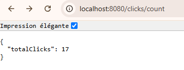

# Gestion de Click Kafka Streams& Spring Boot

Cette application Spring Boot permet de compter en temps réel le nombre de clics utilisateurs à l’aide de Kafka Streams.

## Fonctionnalités

- **Page d’accueil** : chaque utilisateur reçoit un identifiant unique en session.
- **Clic utilisateur** : chaque clic est envoyé dans un topic Kafka (`clicks`).
- **Traitement en temps réel** : Kafka Streams compte le nombre total de clics et publie le résultat dans le topic `click-counts`.
- **Consultation du total** : le service Spring consomme le topic `click-counts` et expose le total des clics.

## Architecture

- **Spring Boot** pour la structure de l’application.
- **Kafka** pour la gestion des messages.
- **Kafka Streams** pour le traitement et l’agrégation en temps réel.

## Résultat attendu

- À chaque clic sur la page, un message est envoyé à Kafka.
- Le nombre total de clics est mis à jour en temps réel et peut être affiché ou utilisé dans l’application.

<table>
    <tr>
        <th>Page d’accueil</th>
        <th>Nombre de clics</th>
    </tr>
    <tr>
        <td></td>
        <td></td>
    </tr>
</table>
## Lancement

1. Démarrer un cluster Kafka local.
2. Lancer l’application avec :  
   `mvn spring-boot:run`
3. Accéder à [http://localhost:8080](http://localhost:8080) et cliquer pour générer des événements.
4. Accéder à [http://localhost:8080/clicks](http://localhost:8080/clicks) pour voir le nombre total de clics.

## Tests

Des tests vérifient le chargement du contexte Spring et l’accessibilité de la page d’accueil.

---
**Auteur** : soufianeelghariaoui